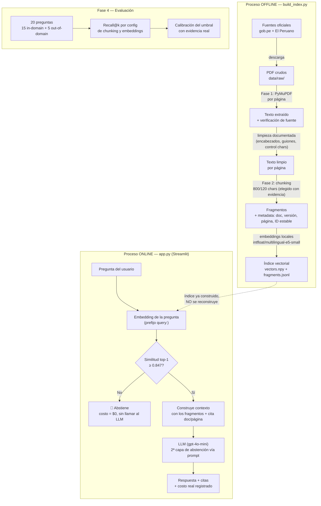
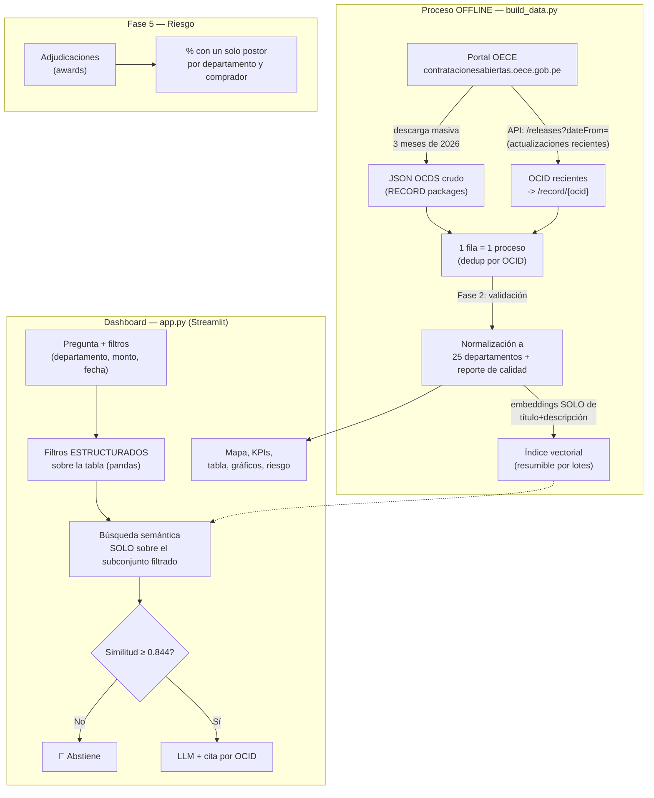

# Diagramas de pipeline

Diagramas en Mermaid (se renderizan directo en GitHub). Pensados para
mostrarse en pantalla durante el video **antes** de mostrar código, tal como
exige el issue ("pipeline-first rule").

## Tarea 1 — RAG Normativo

**Puntos clave para el video:**
- La página se preserva desde la extracción (Fase 1) hasta la cita final — es
  la unidad de trazabilidad de todo el sistema normativo.
- El umbral de abstención (0.847) se calibró comparando la similitud de
  preguntas dentro y fuera del corpus — no es un número arbitrario.
- Hay DOS capas de abstención: una barata (similitud, antes del LLM) y una
  semántica (instrucción al LLM), porque la primera no basta para el caso
  "pregunta del dominio pero fuera de lo indexado" (ver `eval_set.json`, q20).

## Tarea 2 — Radar de Contrataciones

**Puntos clave para el video:**
- El departamento del comprador es metadata desde la Fase 1 (viene en el JSON
  OCDS: `party.address.department`) — se normaliza en la Fase 2, no se infiere.
- Monto y departamento **nunca** se meten al texto que se embebe: son filtros
  de pandas. Si se metieran al embedding, "más de S/ 200,000" no se podría
  resolver de forma exacta (la similitud semántica no entiende desigualdades).
- El indicador de riesgo (single-bidder share) usa las mismas adjudicaciones
  reales del corpus — no es una simulación.
